# Getting started with Barnaba

This guide takes you from an Azure subscription to a first live translation: deploy the
apps, start the system, broadcast a sermon, connect listeners, stop the system and
change the starter password.

The screenshots come from the code in this repository. They show a sample congregation
(`Example Church`), a sample PIN and placeholder addresses. Your names, PIN and addresses
will be different.

> [!IMPORTANT]
> **Starter broadcaster password: `Barnaba2026&!`**
>
> `infra/azure/parameters.example.json` already contains this password, so you can log in
> to the control panel right after the first deployment. Because it is printed here,
> everyone knows it. Anyone who has your control-panel address can use it to start your
> GPU, which you pay for, and to broadcast in your congregation's name.
> **Change it right after the first successful start** — see
> [section 8](#8-change-the-broadcaster-password).

## Contents

1. [What you will run](#1-what-you-will-run)
2. [Before you start](#2-before-you-start)
3. [Deploy to Azure](#3-deploy-to-azure)
4. [Start Barnaba](#4-start-barnaba)
5. [Broadcast a sermon](#5-broadcast-a-sermon)
6. [Connect listeners](#6-connect-listeners)
7. [Stop Barnaba](#7-stop-barnaba)
8. [Change the broadcaster password](#8-change-the-broadcaster-password)
9. [Troubleshooting](#9-troubleshooting)

## 1. What you will run

Barnaba runs as three Azure Container Apps:

| App | What it does | When it runs |
|---|---|---|
| **Control panel** (`<prefix>-control`) | The operator's web page. Starts and stops the other two apps, shows the QR code and PIN for listeners, and sends the preacher's audio. It also serves the listener app and saves the problems that listeners report. | Always |
| **Gateway** (`<prefix>-gateway`) | Receives the audio, sends the recognised text for translation and speech, and delivers translated speech to listeners' phones. | Only during a service |
| **Whisper** (`<prefix>-whisper`) | Speech recognition for Swiss German on an NVIDIA A100 GPU. | Only during a service |

Whisper is where most of the cost comes from. An A100 costs roughly 2–4 USD per hour at
list prices, so start the system shortly before the service and stop it right after.

The path of a sermon: microphone → laptop browser (control panel) → gateway → Whisper
(German text) → Azure OpenAI (translation) → Azure Speech (spoken translation) →
listeners' phones.

## 2. Before you start

Azure:

- An Azure subscription where you are **Owner**. The template creates role assignments,
  which Contributor alone cannot do.
- **A100 quota** in a region that offers the `Consumption-GPU-NC24-A100` workload profile.
- An **Azure OpenAI** resource with a model deployment named exactly **`gpt-4.1`**. The
  default configuration calls a deployment with that name. You need the endpoint and a key.
- An **Azure Speech** resource. You need its key and region.

Your computer:

- [Azure CLI](https://learn.microsoft.com/cli/azure/install-azure-cli), Git and PowerShell.
- No Docker. Azure builds the images for you.

For the service:

- A laptop with **Chrome or Edge** and a microphone, or an audio interface connected to the
  mixing desk.
- Listeners need a smartphone with a browser and headphones.

## 3. Deploy to Azure

All commands below are PowerShell. Replace everything in `<angle brackets>`.

### 3.1 Sign in and check the GPU profile

```powershell
az login
az extension add --name containerapp --upgrade
az containerapp env workload-profile list-supported --location swedencentral --output table
```

If `Consumption-GPU-NC24-A100` is not in the list, pick another region and use it in
every command below.

### 3.2 Create the foundation

The foundation contains the container registry, the Container Apps environment with the
A100 profile, a file share that caches the speech model, a file share for listener
reports, and the managed identities.

```powershell
git clone https://github.com/tomaszpe/barnaba-oss.git
Set-Location barnaba-oss

az group create --name barnaba-oss-rg --location swedencentral `
  --tags project=barnaba environment=dev owner=<your-name> managed-by=bicep system=oss-reference
az deployment group create `
  --resource-group barnaba-oss-rg `
  --template-file infra/azure/foundation.bicep `
  --parameters prefix=barnaba acrName=<globally-unique-acr-name> ownerTag=<your-name> environmentTag=dev
```

### 3.3 Build the images

Azure Container Registry builds all images from this repository. The image tag is the
full Git commit, and the script refuses to run if you have uncommitted changes.

```powershell
$sha = git rev-parse HEAD
./infra/azure/build-images.ps1 -AcrName <globally-unique-acr-name> -ImageTag $sha
```

### 3.4 Fill in the parameters file

Copy the example **outside** the repository, so that your keys never end up in Git:

```powershell
New-Item -ItemType Directory -Force C:\secure
Copy-Item infra/azure/parameters.example.json C:\secure\barnaba.parameters.json
notepad C:\secure\barnaba.parameters.json
```

Change these values:

| Parameter | Value |
|---|---|
| `prefix` | `barnaba` — the same prefix you used for the foundation |
| `environmentName` | `barnaba-env` |
| `acrName` | your registry name from step 3.2 |
| `ownerTag` | your name, as in step 3.2 |
| `imageTag` | the output of `git rev-parse HEAD` |
| `azureOpenAiEndpoint`, `azureOpenAiKey` | from your Azure OpenAI resource |
| `azureSpeechRegion`, `azureSpeechKey` | from your Azure Speech resource |
| `accessPin` | six digits that listeners type to join, for example `482913` |
| `broadcasterPassword` | leave `Barnaba2026&!` for the first start |
| `churchesConfigJson` | your congregations as a JSON text, see below |
| `location` | your region from step 3.1 |

`churchesConfigJson` is a list of congregations written as one line of text. Each entry
needs an `id` (lower-case letters, digits and hyphens) and a display `name`:

```json
"accessPin": { "value": "482913" },
"broadcasterPassword": { "value": "Barnaba2026&!" },
"churchesConfigJson": { "value": "[{\"id\":\"my-church\",\"name\":\"My Church\"}]" }
```

### 3.5 Deploy the apps

```powershell
az deployment group create `
  --resource-group barnaba-oss-rg `
  --name barnaba-apps `
  --template-file infra/azure/apps.bicep `
  --parameters '@C:\secure\barnaba.parameters.json'
```

Read the addresses of your apps:

```powershell
az deployment group show --resource-group barnaba-oss-rg --name barnaba-apps `
  --query properties.outputs --output json
```

`controlPlaneUrl` is the address you need. The operator's page is
**`<controlPlaneUrl>/admin.html`**. Keep that address private.

Check that Whisper and the gateway are not running yet:

```powershell
az containerapp list --resource-group barnaba-oss-rg `
  --query "[].{name:name, state:properties.runningStatus}" --output table
```

If either shows `Running`, stop it from the control panel ([section 7](#7-stop-barnaba))
or with `az containerapp stop`.

## 4. Start Barnaba

Start about 15 minutes before the sermon. The GPU start alone can take up to 12 minutes.

**1. Open the control panel** at `<controlPlaneUrl>/admin.html` in Chrome or Edge on the
broadcasting laptop. Choose your congregation and the audio source:

- **Microphone** — the laptop's microphone or a USB microphone.
- **Line-In / Dante** — audio from the mixing desk or a Dante network.

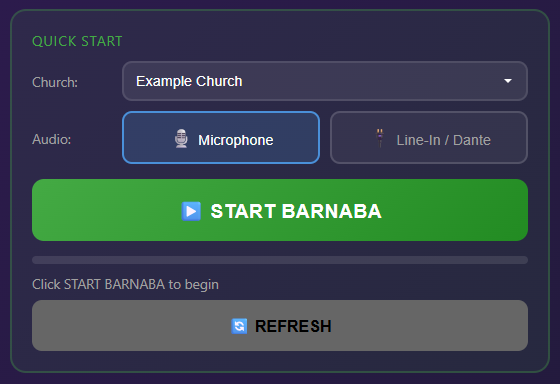

**2. Click START BARNABA** and type the broadcaster password. On a new installation it is
`Barnaba2026&!`. If you mistype it, see the first row of
[Troubleshooting](#9-troubleshooting).

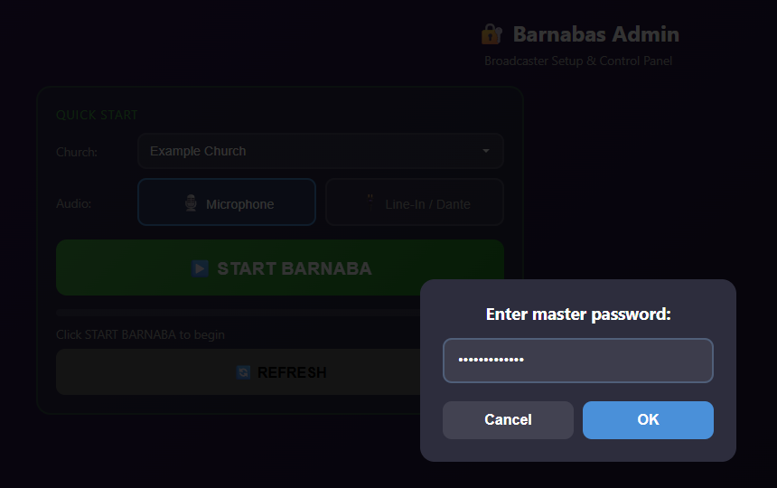

**3. Wait.** The panel starts Whisper on the GPU, loads the speech model and then starts
the gateway. The line under the progress bar shows what is happening and how long it has
been waiting. Keep the page open.

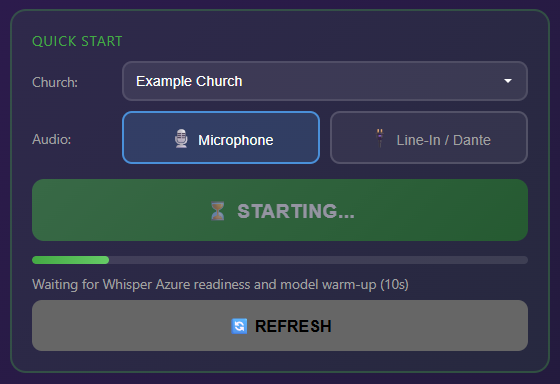

**4. Barnaba is ready** when the button shows **BARNABA ACTIVE**. On the right you see the
QR code, the PIN and the direct link for listeners.

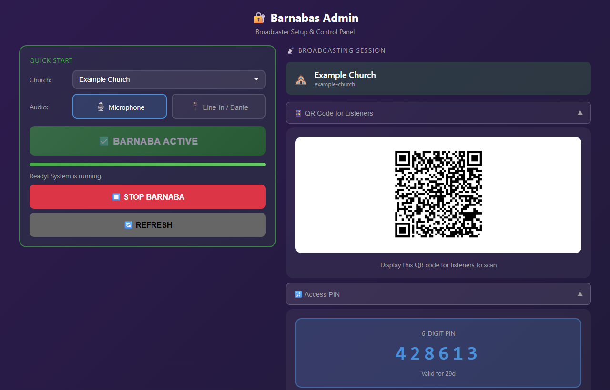

## 5. Broadcast a sermon

Scroll down the right-hand side of the control panel.

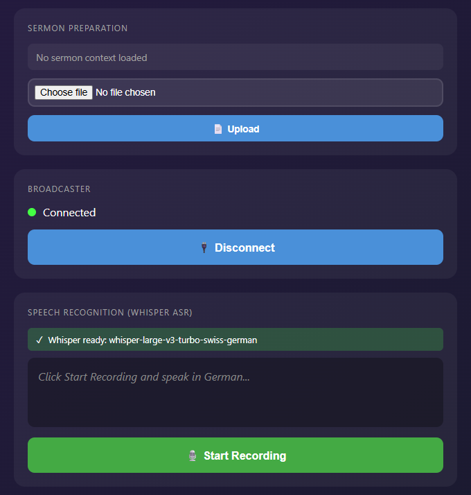

- **Sermon Preparation** (optional). Upload the sermon notes as `.txt`, `.md`, `.jpg` or
  `.png`. The translation uses them only to choose names and theological terms; it does not
  add content from the notes.
- **Broadcaster** connects by itself and shows **Connected**.
- **Speech Recognition** shows **Whisper ready**. When the sermon begins, click
  **Start Recording** and allow microphone access. The recognised German text appears in
  the box. Click **Stop** when the sermon ends.
- **Record Session** (optional) saves the translated speech for the languages you pick
  into a folder on the laptop.

## 6. Connect listeners

Show the QR code on a screen, or read out the PIN. Listeners do this on their phone:

| 1. Choose a language | 2. Read the tips | 3. Choose the church |
|:---:|:---:|:---:|
| 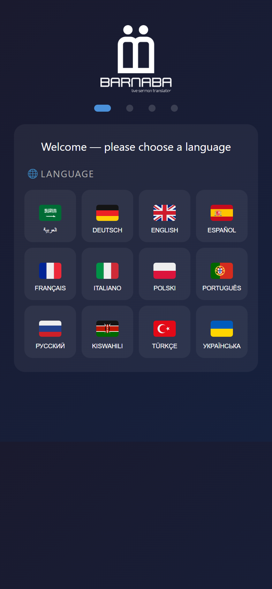 | 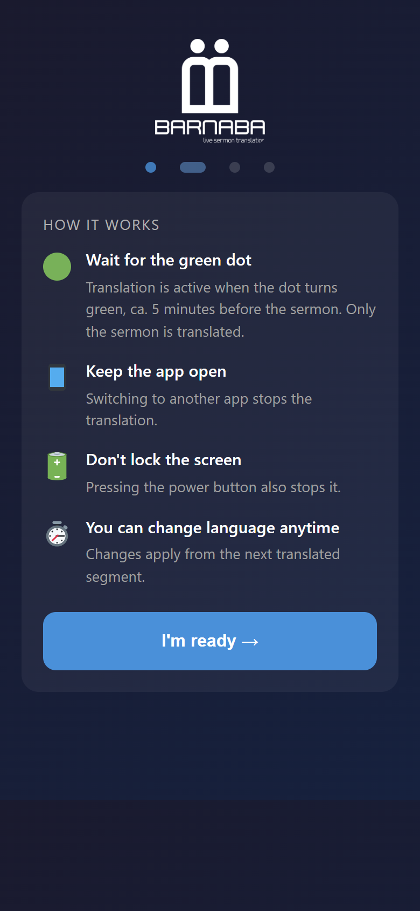 | 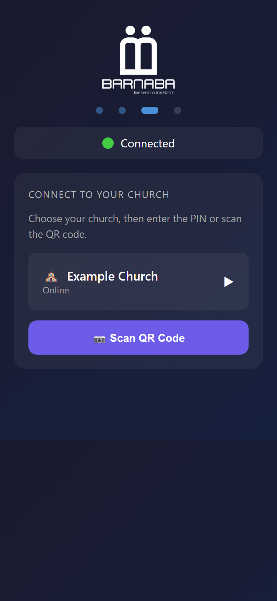 |

| 4. Enter the PIN | 5. Listen |
|:---:|:---:|
| 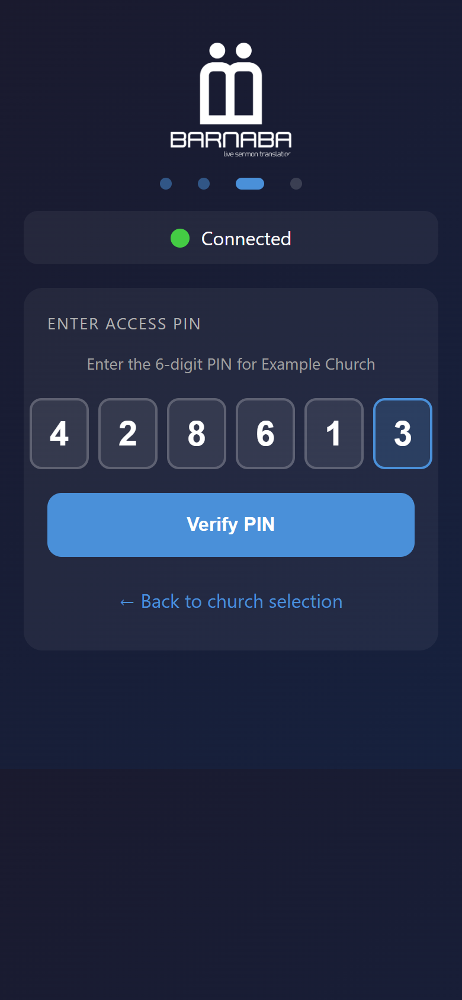 | 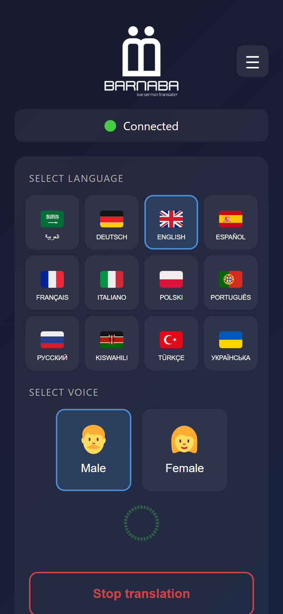 |

Listeners who scan the QR code with the phone camera skip steps 1–3 and go straight to
the PIN. On the last screen they can switch the language and the voice at any time. Tell them to keep the
app open and the screen unlocked: switching to another app or locking the phone stops
the translation.

The blue button at the right edge of the listening screen opens **Report an issue**:
*Wrong word*, *Pause too long*, *Translation is falling behind* or *Other*. **Send
feedback** in the menu (☰) takes a longer comment and, if the listener wants a reply, an
email address. The control panel saves the reports in the `listener-feedback` file share
of the storage account from step 3.2. Only people who have access to that storage account
can read them.

## 7. Stop Barnaba

After the service click **STOP BARNABA** and confirm. This stops Whisper and the gateway
and disconnects all listeners. The control panel keeps running, so you can start again
next time.

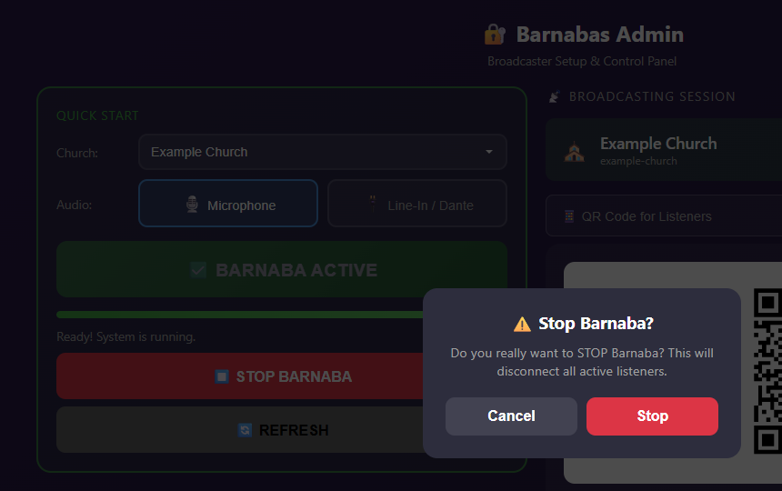

The GPU is billed while Whisper runs, so check afterwards that both apps are stopped:

```powershell
az containerapp list --resource-group barnaba-oss-rg `
  --query "[].{name:name, state:properties.runningStatus}" --output table
```

## 8. Change the broadcaster password

Do this right after your first successful start. Until you do, anyone who finds your
control-panel address can log in with the password from this guide.

**1. Choose a new password** of at least 13 characters that you do not use anywhere else.

**2. Write it into your parameters file** (`broadcasterPassword` in
`C:\secure\barnaba.parameters.json`) and deploy again with the same command as in
[step 3.5](#35-deploy-the-apps).

**3. Restart the control panel**, so that it reads the new password. A changed secret
does not reach an app that is already running until it restarts.

```powershell
$rg = 'barnaba-oss-rg'
$app = 'barnaba-control'
$revision = az containerapp show --resource-group $rg --name $app `
  --query properties.latestRevisionName --output tsv
az containerapp revision restart --resource-group $rg --name $app --revision $revision
```

The gateway reads the new password the next time it starts. If Barnaba is running right
now, stop it and start it again.

**4. Check the result.** Reload the control panel and start Barnaba with the new password.
Then reload again and try the old one: it must no longer work.

Good to know:

- Listeners who were connected must enter the PIN again. Their session key is derived from
  the password and the PIN.
- You change the listener PIN (`accessPin`) the same way.
- If you use `infra/azure/smoke-test.ps1`, set `$env:BROADCASTER_PASSWORD` to the new
  password.

## 9. Troubleshooting

| What you see | What it means and what to do |
|---|---|
| `Control login failed: Invalid password` | The password was wrong. Click **START BARNABA** again and type it once more. If you have just changed the password, check that you restarted the control panel (step 8.3). |
| `Control login failed: Too many requests. Please try again later.` | The control panel accepts at most 10 requests per minute from one address. Wait one minute and try again. |
| `Quick Start failed: Waiting for Whisper Azure readiness and model warm-up timed out after 720s` | Azure did not provide a GPU within 12 minutes. Check your A100 quota for the region and try again. |
| The congregation list is empty | `churchesConfigJson` is missing or not valid JSON. Fix it as in step 3.4 and deploy again. |
| Listeners do not see the congregation | The broadcaster is not connected. Check that the **Broadcaster** section shows **Connected**. |

The complete technical procedure, the security boundaries and the smoke test are in
[infra/azure/README.md](../infra/azure/README.md).
